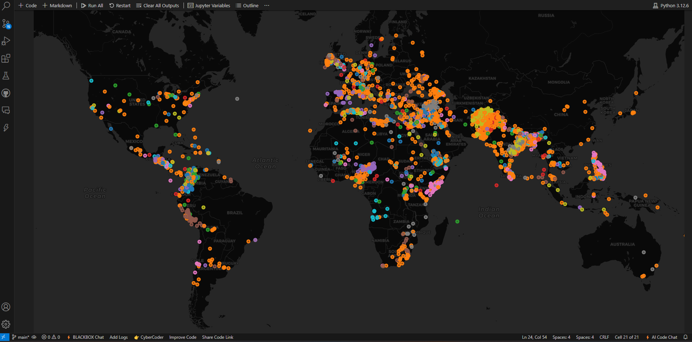

# **Global Terrorism Analysis Using Machine Learning**

## **📌 Overview**
This project leverages **Machine Learning** to analyze **global terrorism data**, utilizing **Decision Trees** and **Random Forest algorithms**, including a **custom Random Forest implementation from scratch**. The primary objective is to predict the **success of terrorist attacks** and visualize attack patterns using interactive maps.

## **📂 Dataset**
- **Source**: Global Terrorism Database (50% sampled dataset for efficiency)
- **Number of Features**: 135 (reduced during preprocessing)
- **Key Features Used**:
  - **Temporal**: Year, Month, Day
  - **Geographical**: Latitude, Longitude, Country, Region
  - **Attack Details**: Attack Type, Target Type, Weapon Type
  - **Casualties**: Number of killed (`nkill`), Number of wounded (`nwound`), Combined (`Casualties`)
  - **Terrorist Group (`gname`)**
  - **Outcome (`success`)** - **Target Variable**

## **📌 Features & Functionalities**
- **🧠 Machine Learning Models:**
  - Decision Tree Classifier
  - Scikit-learn’s Random Forest Classifier
  - **Custom-built Random Forest Algorithm**
- **📊 Performance Metrics:**
  - Accuracy Score
  - F1 Score
  - Feature Importance Analysis
- **🌍 Interactive Visualizations:**
  - Bar charts for top terrorist groups
  - Attack location maps (Colored by **terrorist group**)
- **📄 Model Evaluation Results:**
- a.	Using big dataset: 
  | Model | Accuracy | F1 Score |
  |--------|------------|-------------|
  | Scikit-learn Random Forest | 94.1% | 94.1% |
  | Custom Random Forest | 88.8% | 87.8% |

b.	Using sample dataset:
| Model | Accuracy | F1 Score |
  |--------|------------|-------------|
  | Scikit-learn Random Forest | 94.2% | 94.2% |
  | Custom Random Forest | 85.3% | 85.3% |


## **⚡ Installation & Setup**
### **1️⃣ Clone the Repository**
```bash
git clone https://github.com/yourusername/yourrepository.git
cd yourrepository
```

### **2️⃣ Install Dependencies**
```bash
pip install -r requirements.txt
```
(If using Jupyter Notebook, install `jupyter`)

### **3️⃣ Run the Analysis**
- Run the **Jupyter Notebook**:
  ```bash
  jupyter notebook gobal_terror_attack.ipynb
  ```
- Run the **Python script**:
  ```bash
  python gobal_terror_attack.py
  ```

## **📌 Usage**
1. **Preprocess the dataset** (Handles missing values, encodes categorical features, applies SMOTE)
2. **Train & Compare Models** (Decision Trees, Random Forests)
3. **Visualize Data** (Plots, interactive maps)
4. **Save & Download Map Outputs** (`terror_map.html`, `terror_map.png`)

## **📷 Visuals**
### 📍 **Example of an Attack Map (Colored by Terrorist Group)**


## **🤝 Contributing**
Want to contribute? **Fork the repo** and submit a pull request with improvements!

## **📜 License**
This project is **open-source** under the **MIT License**.

## **📬 Contact**
For queries, reach out:
📧 Email: [your_email@example.com](mailto:your_email@example.com)  
🌍 GitHub: [yourusername](https://github.com/yourusername)

---
### **🚀 Next Steps**
- **Modify placeholders** (e.g., `yourusername`, dataset location, images).
- **Upload the map output (`terror_map.png`)** for visuals.
- **Enhance with more analysis and predictions.**

Let me know if you need **further refinements!** 🚀

